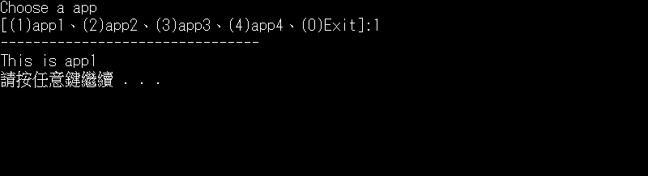
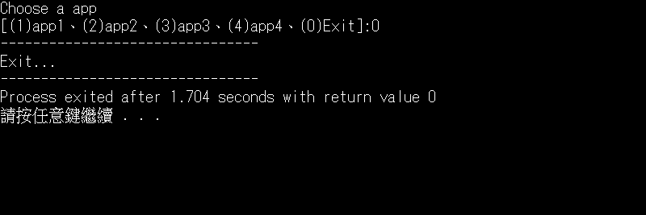

# C++ 學習紀錄
這裡為過去學習C++的紀錄 
主要以章節區分 
較完整作品如`lottofix....`等
# 閱讀方式
## main.cpp
###### 功能簡介
基於同一章節之程式希望能**放在同一個專案中**，利用主程式呼叫副程式，讓使用者自行從**多個程式中選一執行之功能** 
###### 說明
上課時發現，一項專案中雖可有多個原始碼，但**只能有一個main()的主程式**。若將多個程式都以原始碼形式放入同一專案檔中，程式將會無法執行，除非再將各原始碼單獨開啟，但如此一來**效率極低**。最初的處理方式是將每個程式都開新專案，但一堆專案使得檔案**雜亂無章**，在整理章節作品時非常辛苦，若可將同章節程式整理成一個專案即可方便許多！因此最終決定利用主程式與副程式，製作一個｢**程式選擇器**｣，將同一章節原始碼以副程式，全放在一個程式選擇器專案中，這樣不只在整理上更方便，在批改分數時也不用再一個個開啟程式，**讓檔案整齊還有效率！**同時也學會了**利用網路上的資源自主學習，解決自己在生活中遇到的問題！**
###### 執行範例

 
## 原始碼
建議下載**XXX.cpp**後 
將程式名稱修改成main 
`appX(){... -> main(){...`
即可使用
 
## 執行檔
若想直接下載執行檔 
則直接下載該專案的`.exe`檔即可
